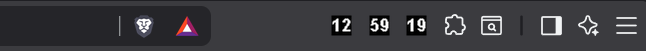
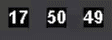

<div align="center">

# 🕒 Chrome Extension Clock


<br>


<br>

### Three lightweight Chrome extensions that work together to display

<div align="center">



</div>

### hours, mins and seconds directly inside your browser toolbar.

</div>


## 🎬 Preview



Hours. Minutes. Seconds.

Always visible.

No taskbar hunting.

No additional windows.

No distractions.

---

## ✨ Why?

While experimenting with Chrome extensions, I came across separate toolbar clocks for hours and minutes.

That raised a simple question:

> Where are the seconds?

This project explores an alternative approach by splitting time into three dedicated Chrome extensions:

```text
[HH] [MM] [SS]
```

Each extension renders its value directly into the toolbar icon using dynamic canvas rendering.

---

## 🚀 Features

### Toolbar Hours

Displays the current hour.

```text
[13]
```

### Toolbar Minutes

Displays the current minute.

```text
[47]
```

### Toolbar Seconds

Displays the current second.

```text
[22]
```

### Shared Features

* Dynamic icon rendering
* Real-time updates
* Manifest V3 architecture
* Startup recovery after browser restart
* Lightweight implementation
* No tracking
* No external services

---

## 🏗️ Technical Challenges

Manifest V3 replaces persistent background pages with service workers.

While building this project, I experimented with:

* Service worker lifecycle management
* Startup event handling
* Dynamic icon rendering with OffscreenCanvas
* Browser restart recovery
* Timer synchronization strategies

One interesting discovery was that a simple interval-based approach proved more reliable for this use case than alarm-based scheduling.

---

## 📂 Project Structure

```text
toolbar_clock/
│
├── assets/
│   ├── chrome-toolbar-clock.gif
│   └── screenshot-long.png
│
├── toolbar_hours/
│   ├── manifest.json
│   └── service-worker.js
│
├── toolbar_minutes/
│   ├── manifest.json
│   └── service-worker.js
│
├── toolbar_seconds/
│   ├── manifest.json
│   └── service-worker.js
│
├── .gitignore
│
└── README.md
```

---

## 🛠️ Built With

* JavaScript
* Chrome Extensions API
* Manifest V3
* OffscreenCanvas
* Service Workers

---

## 📈 Roadmap

### Current

* [x] Toolbar Hours
* [x] Toolbar Minutes
* [x] Toolbar Seconds
* [x] Dynamic icon rendering
* [x] Startup recovery
* [x] Browser restart handling

### Planned

* [ ] Countdown timer
* [ ] Stopwatch mode
* [ ] Timestamp utilities
* [ ] Productivity tools
* [ ] Chrome Web Store release

---

## 🚀 Installation

### Load Unpacked

```bash
git clone git@github.com:preritvishal/Chrome-Extension-Clock.git
```

Open:

```text
chrome://extensions
```

1. Enable Developer Mode
2. Click **Load unpacked**
3. Select one of:

   * toolbar_hours
   * toolbar_minutes
   * toolbar_seconds
4. Pin the extension

---

## 📜 License

Licensed under the MIT License.

---

<div align="center">

### ⭐ If you found this project interesting, consider giving it a star.

Built with coffee ☕, curiosity 🚀, and an unreasonable amount of time spent making clocks tell the correct time.

</div>
